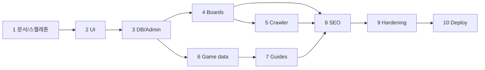

# 12. 개발 로드맵

CLIPS는 **10단계**로 기능을 확장한다. **1단계·2단계·메인 UX·Phase 3.7 CDL·Phase 3.8 Dual Theme**까지 완료로 본다(2026-07-28 기준).

**범례:** **확정** / **향후 결정**

---

## 전체 개요

| 단계 | 이름 | 핵심 산출 |
|------|------|-----------|
| 1 | 프로젝트 생성 및 문서 | 실행 가능 스켈레톤 + docs |
| 2 | 공통 레이아웃·디자인 | UI 시스템·페이지 골격 |
| 3.7 | CLIPS Design Language | 토큰·컴포넌트 규격·쇼케이스·CDL 문서 |
| 3.8 | Dual Theme System | Eclipse/Dawn · system/light/dark |
| 3 | DB·관리자 인증 | PostgreSQL/SQLite, admin login |
| 4 | 공지·이벤트·업데이트 | boards SSR + admin CRUD |
| 5 | 크롤러 | 자동/수동 수집 + 검수 |
| 6 | 클래스·아이템·보스·지도 | 게임 DB 공개 |
| 7 | 공략·커뮤니티 | 가이드·UGC(범위 TBD) |
| 8 | SEO 고도화 | JSON-LD, RSS, Search Console |
| 9 | 성능·보안·테스트 | hardening + CI 게이트 |
| 10 | 배포·검색엔진 등록 | prod + sitemap submit |

---

## 1단계: 프로젝트 생성 및 문서

### 목표

로컬에서 CLIPS를 실행하고, **설계 문서·품질 도구·SEO·헬스** 골격을 갖춘다.

### 확정 범위

- FastAPI + Jinja SSR, `/`, `/health`, `/robots.txt`, `/sitemap.xml`
- `pyproject.toml`, pytest, Ruff, mypy, pre-commit
- `docs/00`~`12` 작성 (실질 내용, 확정/향후 구분)
- 메인 홈 **레이아웃 골격** (완성 디자인 아님)
- `.env.example`, production `SECRET_KEY` 검증

### 완료 조건

- [x] `pip install -e ".[dev]"` 성공
- [x] `pytest` 전부 통과 (`test_health`, `test_home` + SEO 라우트)
- [x] `ruff check` / `mypy app` 통과
- [x] `uvicorn app.main:app` 로 `/` 200, H1 1개, meta description 존재
- [x] `docs/` 13개 파일(00~12) 비어 있지 않음
- [x] README에 설치·실행·문서 링크
- [x] Git 저장소 초기화 가능 상태 (원격 push는 선택)

### 향후 결정

- 원격 저장소 URL, 브랜치 전략

---

## 2단계: 공통 레이아웃과 디자인 시스템

### 목표

**모든 공개 페이지**가 공유하는 header/footer, 토큰, 컴포넌트, 반응형·접근성 기준을 완성한다.

### 확정 범위

- [05-ui-design-system.md](05-ui-design-system.md) 토큰·컴포넌트 적용
- `base.html`, header 햄버거, footer 비공식 고지
- `coming_soon.html` 및 준비 중 라우트 패턴 ( `#` 링크 금지)
- 페이지별 CSS split (`pages/*.css`)
- `prefers-reduced-motion` 대응

### 완료 조건

- [x] 9개 주 메뉴가 준비 중 또는 실제 경로로 연결 (깨진 `#` 없음)
- [ ] 모바일·데스크톱 레이아웃 QA (320px~1280px) — **브라우저 수동 QA 권장**
- [ ] Lighthouse 접근성·SEO **기본** 점수 기록 (baseline)
- [x] 404/500이 base 레이아웃·토큰 사용
- [x] 컴포넌트: card, button, badge, empty_state 문서와 일치
- [x] 메인 6섹션(히어로·빠른 메뉴·소식·플랫폼·아카이브·CTA) SSR
- [x] `pytest` UI/SEO 확장 테스트 통과

### 향후 결정

- 다크/라이트 토글
- 공식 에셋 적용 여부

---

## Phase 3.7: CLIPS Design Language (CDL)

### 목표

앞으로의 모든 화면이 공유할 **토큰·타이포·아이콘·컴포넌트 규격**을 확정하고, 개발용 쇼케이스로 검증한다. **기능(DB/검색/CRUD)은 포함하지 않는다.**

### 확정 범위

- [x] `tokens.css` CDL 토큰 체계
- [x] 타이포 역할 클래스, utilities, 레이아웃 패턴
- [x] 버튼·카드·배지·태그·상태·폼·테이블·탭·페이지네이션·아티클 CSS
- [x] Icon Language 레지스트리 정리
- [x] `/dev/design-system` (local/development만, noindex, sitemap 제외)
- [x] [13-clips-design-language.md](13-clips-design-language.md) 단일 기준 문서
- [x] [05-ui-design-system.md](05-ui-design-system.md) 개요·링크 정리

### 완료 조건

- [x] 기존 메인 UX 유지 (대규모 재설계 없음)
- [x] 쇼케이스 local 200 / production 404 테스트
- [x] pytest / ruff / mypy 통과

### 다음 제안

실제 DB 전에 **정보 페이지 UI 골격 + Mock 데이터 구조** 단계를 진행한다.

---

## Phase 3.8: Dual Theme System (Eclipse / Dawn)

### 목표

기존 Eclipse 다크를 유지하고, CDL을 계승한 Dawn 라이트 테마와 system/light/dark 설정을 제공한다.

### 확정 범위

- [x] 토큰 기반 light/dark (`tokens.css`)
- [x] FOUC 방지 head 스크립트 + `theme.js`
- [x] 헤더 테마 팝오버 (시스템/라이트/다크)
- [x] CLIPS 테마 아이콘
- [x] [14-theme-system.md](14-theme-system.md)

### 완료 조건

- [x] localStorage `clips-theme`, 기본 system
- [x] 전 페이지·CDL 컴포넌트 토큰 전환
- [x] pytest / ruff / mypy 통과

### 다음 제안

테마가 확정된 CDL 위에서 **정보 페이지 UI 골격 + Mock 데이터 구조**를 설계한다.

---

## 3단계: DB 및 관리자 인증

### 목표

**Alembic 마이그레이션**, 핵심 테이블 초안, **관리자 로그인·세션·감사 로그** 기반.

### 확정 범위

- [03-database-design.md](03-database-design.md) 1차 테이블: `admin_users`, `admin_audit_logs`
- bcrypt/argon2, CSRF, login rate limit
- `/admin/login`, dashboard shell
- SQLite 로컬 + PostgreSQL 연결 검증

### 완료 조건

- [ ] `alembic upgrade head` clean on empty DB
- [ ] admin login/logout/CSRF 테스트 green
- [ ] production settings validation 테스트
- [ ] audit log on login success/failure
- [ ] [08-admin-design.md](08-admin-design.md) §2~3 구현

### 향후 결정

- bootstrap admin CLI vs seed migration

---

## 4단계: 공지, 이벤트, 업데이트

### 목표

**소식(boards)** 공개 SSR + 관리자 CRUD, 카테고리별 목록·상세.

### 확정 범위

- categories: notices, updates, events (+ gm-notes **향후** 동일 패턴)
- pagination, SEO meta per post
- soft delete, pin (admin)
- 샘플 seed (optional, dev only)

### 완료 조건

- [ ] `GET /boards/{category}`, `GET /boards/{category}/{slug}` 200 + SEO
- [ ] admin posts CRUD + audit
- [ ] repository/service layer (router thin)
- [ ] integration tests for CRUD + public read
- [ ] sitemap에 게시물 URL 포함 (published only)

### 향후 결정

- slug vs id URL
- RSS per category

---

## 5단계: 크롤러

### 목표

[07-crawling-strategy.md](07-crawling-strategy.md)에 따른 **스케줄·수동·upsert·검수** 연동.

### 확정 범위

- crawl_service + scheduler
- `source_url` UNIQUE, excerpt/summary only
- admin crawl UI + run logs
- fixture-based parser tests

### 완료 조건

- [ ] 자동 run (interval env) + manual refresh
- [ ] 공식 소스 1개 이상 end-to-end (staging mock or approved source)
- [ ] pinned/hidden/manual_override upsert rules tested
- [ ] robots/policy documented for chosen source
- [ ] no full body HTML stored (DB inspection checklist)

### 향후 결정

- multi-source adapters
- 상세 URL fetch

---

## 6단계: 클래스, 아이템, 보스, 지도

### 목표

게임 **정적/준정적 데이터** 공개 및 관리자 편집(초안).

### 확정 범위

- domains: class, skill, item, boss, region, map marker
- list/detail templates, internal linking
- admin CRUD (editor role)

### 완료 조건

- [ ] 각 도메인 public list + detail ≥1 route
- [ ] DB schema migrated, seed or import path documented
- [ ] cross-link (e.g. boss → region)
- [ ] empty state when no data
- [ ] basic search index fields prepared (**full search 7~8단계**)

### 향후 결정

- datamine vs manual wiki
- image policy for icons

---

## 7단계: 공략 및 커뮤니티 기능

### 목표

**공략(guides)** 및 제한적 커뮤니티(댓글/제보 등) — 범위는 **최소 MVP**.

### 확정 방향

- guides: markdown or rich text **plain** + author attribution
- UGC moderation queue (admin)
- separate license/출처 from crawled posts

### 완료 조건

- [ ] guides list/detail + admin publish
- [ ] (선택) coupon submit / comment — **하나** MVP feature complete if in scope
- [ ] spam rate limit + report hook
- [ ] privacy notice draft linked

### 향후 결정

- full comment system vs external Discord link only
- user accounts public site

---

## 8단계: SEO 고도화

### 목표

[06-seo-strategy.md](06-seo-strategy.md) **구조화 데이터·RSS·색인 정책** 완성.

### 확정 범위

- JSON-LD: WebSite, BreadcrumbList, Article, FAQPage (해당 페이지)
- pagination/canonical rules
- RSS (boards)
- Search/noindex policy enforced in templates

### 완료 조건

- [ ] Rich Results Test pass for home + article + breadcrumb samples
- [ ] sitemap segmented or single with priorities documented
- [ ] RSS valid feed validator
- [ ] SEO admin overrides wired (8-admin §9)
- [ ] `tests/test_seo_*.py` green

### 향후 결정

- VideoObject for media
- multi-language hreflang

---

## 9단계: 성능, 보안, 테스트

### 목표

[09-security-strategy.md](09-security-strategy.md), [10-testing-strategy.md](10-testing-strategy.md) **운영 수준** 달성.

### 확정 범위

- Nginx rate limit config documented
- upload validation if banners live
- pip-audit in release process
- CI lint+test (**향후** GitHub Actions)
- perf smoke, N+1 review on hot paths

### 완료 조건

- [ ] security test suite green (CSRF, XSS, upload)
- [ ] admin audit retention job
- [ ] backup restore **한 번** staging에서 검증
- [ ] Core Web Vitals baseline on 3G Fast (document numbers)
- [ ] 배포 전 체크리스트 10 §15 전 항목 실행 기록

### 향후 결정

- WAF, CSP enforce

---

## 10단계: 배포 및 검색엔진 등록

### 목표

[11-deployment-strategy.md](11-deployment-strategy.md)에 따라 **production** 가동 및 **Google·네이버** 등록.

### 확정 범위

- Ubuntu + Nginx + systemd + HTTPS
- PostgreSQL prod
- `APP_BASE_URL` production domain
- robots/sitemap production URLs

### 완료 조건

- [ ] `/health` external monitor green 7 days
- [ ] Google Search Console property verified + sitemap submitted
- [ ] Naver Search Advisor (또는 equivalent) sitemap/RSS submitted
- [ ] production `.env` secure, no default SECRET_KEY
- [ ] rollback drill documented and executed once
- [ ] 비공식 고지·저작권 footer live

### 향후 결정

- CDN (Cloudflare)
- status page

---

## 단계 간 의존성

---

## 현재 상태 (2026-07-27)

### 확정

- 1단계: 앱 스켈레톤, 테스트, lint, partial docs — **1단계 완료 조건 일부 충족**, 07~12 본 작성으로 문서 항목 진전

### 향후 결정

- 2단계 착수 시점 (1단계 체크리스트 100% 후 권장)

---

## 변경 이력

| 날짜 | 요약 |
|------|------|
| 2026-07-27 | 10단계 로드맵 및 DoD 초안 |
